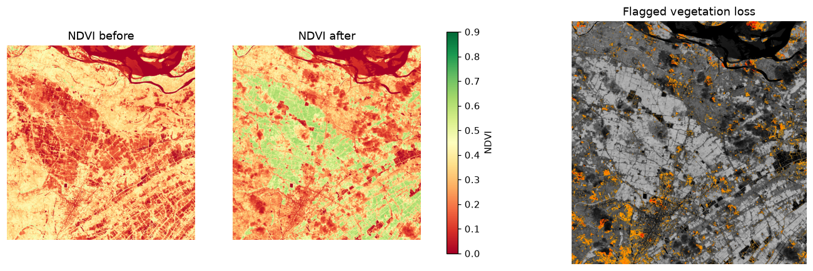

# aerial-change-intelligence

Compares "before" and "after" aerial or satellite images and finds what changed. A neural network outputs a
pixel mask with a confidence score for every pixel, GeoPandas turns the mask into polygons and measures the
affected area in hectares, and a second track flags vegetation loss in the Godavari delta (India) from
free Sentinel-2 satellite data. Everything uses public data only.

**Status:** phases 1-4 (data, model, confidence masks, GeoPandas area) and phase 6 (crop-stress track) are done.
Still to come: the Gemini report with its validation step, the Streamlit dashboard, and optionally xBD building damage.



Results on the LEVIR-CD test split (128 unseen image pairs, threshold 0.5):

| Precision | Recall | F1 | IoU | Calibration error (ECE) |
|---|---|---|---|---|
| 0.908 | 0.889 | 0.898 | 0.815 | 0.007 |

## Tools and libraries used, and why

| Tool | Why |
|---|---|
| PyTorch (`mps` device) | Trains the model on the Mac's GPU; no CUDA needed |
| torchvision | Gives a pretrained ResNet18, so the model starts with useful image features |
| GeoPandas + Shapely | Polygons and area calculations on real map geometry |
| rasterio | Converts pixel masks into polygons and reads satellite files |
| pystac-client + planetary-computer | Free access to Sentinel-2 from Microsoft's public catalog, no account |
| NumPy / Pillow / matplotlib | Arrays, image loading, plots |
| pytest | Tests |

## File structure

```
README.md                    this file
requirements.txt             Python packages
.env.example                 placeholder for the Gemini key (later phases); copy to .env
.gitignore                   keeps secrets, data, and checkpoints out of git
docs/godavari_ndvi.png       example output of the crop-stress track (Sentinel-2 only)
docs/test_metrics.json       final test-set numbers
src/aci/device.py            picks the Apple GPU ("mps") if available
src/aci/data.py              loads LEVIR-CD pairs; random crops and flips for training
src/aci/model.py             Siamese U-Net (shared ResNet18 encoder + decoder)
src/aci/metrics.py           precision, recall, F1, IoU, calibration error
src/aci/train.py             trains the model, saves checkpoints/best.pt and outputs/metrics.json
src/aci/predict.py           one image pair -> probability map, mask, mean confidence
src/aci/geo.py               mask -> polygons -> area (m2 / hectares) with GeoPandas
src/aci/analyze.py           prediction + polygons + area + overlay picture, in one command
src/aci/sentinel.py          downloads cloud-free Sentinel-2 crops for two dates
src/aci/ndvi.py              NDVI math and the "vegetation loss" rule
src/aci/crop_stress.py       two Sentinel-2 dates -> loss polygons -> hectares
src/aci/viz.py               draws the crop-stress picture
tests/                       pytest tests for metrics, model, data, geo, NDVI
data/                        downloaded datasets (not in git)
outputs/, checkpoints/       generated results and model weights (not in git)
```

## Setup

```bash
conda create -n aerial-change-intelligence python=3.11 -y
conda activate aerial-change-intelligence
pip install -r requirements.txt
```

Download LEVIR-CD (about 2.4 GB, public Hugging Face mirror used by TorchGeo; no login) and unpack it so that
`data/raw/levir-cd/` contains the folders `A/`, `B/`, `label/`:

```bash
mkdir -p data/raw/levir-cd && cd data/raw
B=https://huggingface.co/datasets/satellite-image-deep-learning/LEVIR-CD/resolve/6a6bb0a5b389403d81c05e33bf08bc0b9e5f13a6
for s in train val test; do curl -L -o $s.zip $B/$s.zip; unzip -q $s.zip -d levir-cd; done
cd ../..
```

## How to run

All commands run from the project folder with `export PYTHONPATH=src` set once.

```bash
export PYTHONPATH=src
python -m aci.train --epochs 30                 # about 15 minutes on an M4 Pro
python -m aci.analyze data/raw/levir-cd/A/test_10.png data/raw/levir-cd/B/test_10.png
python -m aci.sentinel                          # Godavari delta, Dec 2024 vs Mar 2025
python -m aci.crop_stress && python -m aci.viz
pytest                                          # run the tests
```

Outputs land in `outputs/` (GeoJSON polygons, `area_summary.json`, overlay pictures).

## How it was built

1. Chose LEVIR-CD (small, clean building-change labels) and downloaded it, verifying file checksums.
2. Wrote the loader: random 256x256 crops, flips, and before/after swaps, so the model learns from many views.
3. Built a Siamese U-Net: the same ResNet18 reads both images, and the decoder sees how their features differ.
4. Trained with binary cross-entropy + Dice loss (Dice handles the fact that only 1-3% of pixels change).
5. Evaluated on full 1024x1024 images, and checked calibration so "0.9 confidence" really means about 90%.
6. Turned the probability map into a mask, then into polygons, then measured area in a metric coordinate system.
7. Added the crop track: fetched two Sentinel-2 scenes from the same satellite tile, masked clouds, computed NDVI, flagged big drops.
8. Wrote tests for each building block.

## Key concepts

- **Change detection as segmentation:** the model labels every pixel "changed" or "not changed".
- **Siamese network:** one set of weights processes both images, so the features are comparable.
- **Confidence and calibration:** a sigmoid gives a probability per pixel; ECE measures whether those probabilities can be trusted.
- **Class imbalance:** most pixels don't change, so plain accuracy is misleading; use F1 and IoU, and Dice loss.
- **Precision vs recall:** precision = how many flagged pixels were really changed; recall = how many real changes were found.
- **Area needs a metric CRS:** lat/lon degrees are not metres, so GeoPandas data is reprojected (e.g. UTM) before measuring area.
- **NDVI:** (NIR - Red) / (NIR + Red); healthy plants reflect lots of near-infrared, so high NDVI means green vegetation.

## Honest limitations

- **LEVIR-CD has no real coordinates.** Its area figures assume 0.5 m per pixel on a local grid; they are real-scale but not located on a map. xBD (optional later) has true coordinates.
- **The crop track has no ground truth and detects vegetation loss, not proven crop stress.** In the dry season, a drop in NDVI between December and March mostly means harvest, fallow fields, or flooded aquaculture ponds, not disease or drought. The "confidence" there is a scaled NDVI drop, not a model probability. A fair test would compare the same dates across years, or add field labels.
- Cloud masking uses Sentinel-2's own scene classification, which is imperfect (thin cloud and haze can slip through).
